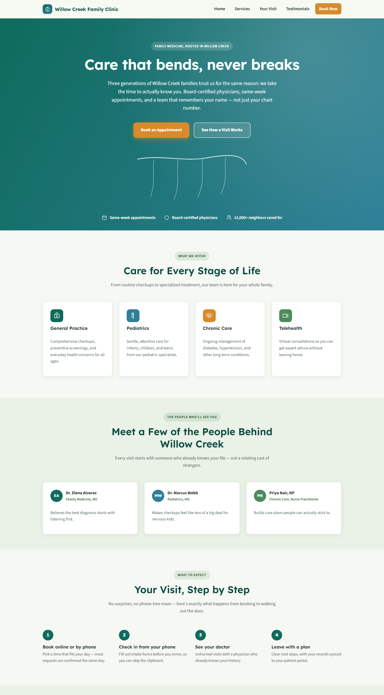

# Willow Creek Family Clinic

A clean, modern, single-page marketing site for a healthcare/family clinic - built with plain HTML, CSS, and vanilla JavaScript. No frameworks, no build step, no dependencies.

**Live site:** https://edkhng-ai.github.io/Edmund/



## Features

- Sticky, mobile-friendly navbar with smooth-scroll anchor navigation
- Full-width gradient hero with a hand-drawn willow-branch signature motif that draws itself in on scroll
- Services overview, a "Meet the Care Team" section, and a real "Your Visit, Step by Step" 4-step timeline
- Patient testimonials grid with star ratings
- New Patient Welcome Guide — a low-friction email-gated lead magnet
- Appointment enquiry form with client-side validation (required fields, email/phone format), inline error messages, and a success confirmation - no page reload, no backend required
- Scroll-triggered fade-in animations via `IntersectionObserver`, respecting `prefers-reduced-motion`
- Accessible by default: semantic HTML5, labeled form fields, `aria-invalid`/`aria-describedby` on errors, keyboard-friendly navigation
- SEO-ready: canonical link, Open Graph/Twitter cards, and `MedicalClinic` JSON-LD structured data
- Footer with contact details, quick links, and an auto-updating copyright year

## Getting started

No installation or build tools needed. Just open the file:

```
index.html
```

directly in a browser (double-click it, or open it as a `file://` URL).

## Project structure

```
index.html   -> entire site: markup, inline <style>, inline <script>
CLAUDE.md    -> guidance for AI coding agents working in this repo
```

Everything - layout, styling, and behavior - lives in the one `index.html` file, organized into clearly delimited sections (navbar -> hero -> services -> care team -> your visit -> testimonials -> new patient guide -> enquiry form -> footer, followed by a script block covering footer-year injection, mobile nav toggle, scroll animations, and both forms' handling).

## Form submissions

Both the appointment enquiry form and the New Patient Guide form validate input and log the submitted data to the browser console (`enquiryData` / `leadMagnetData`) - neither sends data anywhere. A commented-out `fetch(...)` call above each marks the spot to wire up a real backend/API endpoint later.

## Deployment

This repo deploys automatically to **GitHub Pages** via **GitHub Actions** on every push to `main` (see [`.github/workflows/deploy-pages.yml`](.github/workflows/deploy-pages.yml)). You can also trigger a deployment manually from the **Actions** tab.

## Customization

Colors, fonts, and spacing are controlled by CSS custom properties defined at `:root` in `index.html` (e.g. `--color-primary`, `--color-willow`, `--color-creek`, `--color-sun`). Update those variables to re-theme the site without touching individual component styles.
